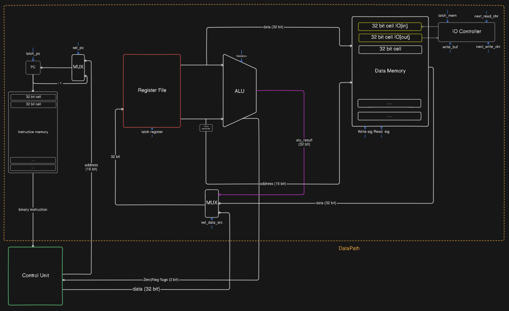
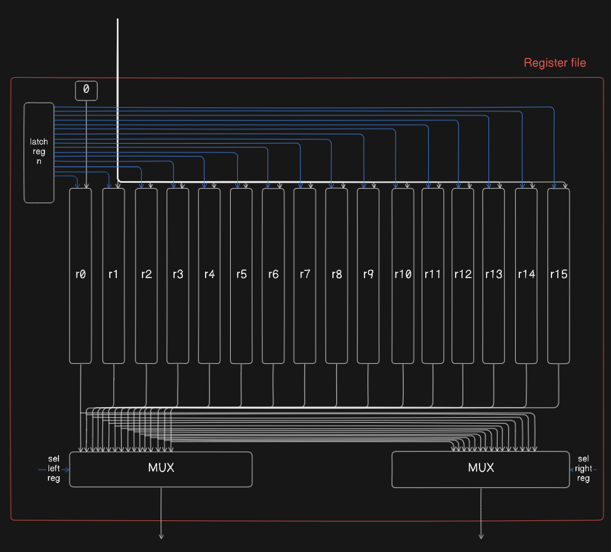
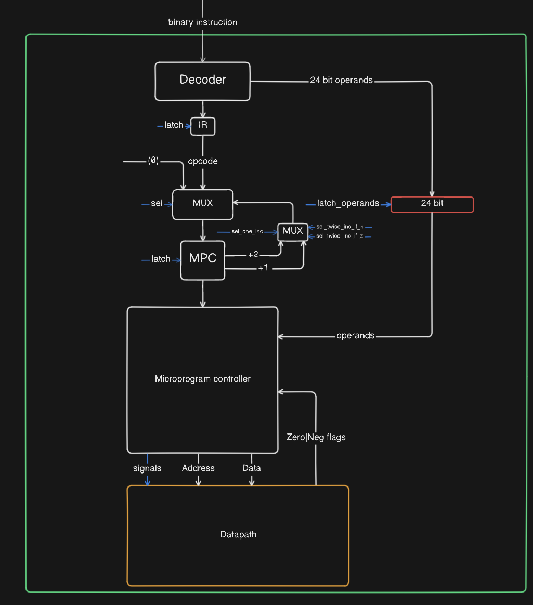

# Эксперементальная модель процессора и транслятора

Пархоменко Кирилл Александрович P3212

## Вариант (Базовый)

```asm | risc | harv | mc | instr | binary | stream | mem | cstr | prob2```

Примечание:

Хотя в варианте указана точность моделирования `instr`, была реализована `tick`, так как архитектура включается в себя микрокоманды

## Язык программирования

### Синтаксис

По варианту нужно реализовать ассемблер для архитектуры RISC

```ebnf
<program> ::= { <section> }

<section> ::= "." "text" { <instruction> }
            | "." "data" { <data_definition> }

<instruction> ::=
               | "halt"
               | "nop"
               | "jmp" <label>
               | "beq" <register> "," <register> "," <label>
               | "bne" <register> "," <register> "," <label>
               | "bgt" <register> "," <register> "," <label>
               | "blt" <register> "," <register> "," <label>
               | "add" <register> "," <register> "," { <label> | <number> | <register> }
               | "sub" <register> "," <register> "," { <label> | <number> | <register> }
               | "and" <register> "," <register> "," { <label> | <number> | <register> }
               | "mul" <register> "," <register> "," { <label> | <number> | <register> }
               | "lw" <register> "," <register>
               | "sw" <register> "," <register>
               | <label> ":"


<data_definition> ::= <identifier> ":" <data_value>
                    | <comment>

<data_value> ::= <string>
               | <number>
               | <comment>

 <register> ::= "r" <number>

 <operand> ::= <register>
            | "#" <number>
            | <identifier>

 <label> ::= "." <identifier>

<identifier> ::= <letter> { <letter> | <digit> }
               | <identifier> "." <identifier>

<number> ::= <digit> { <digit> }

<string> ::= "\"" { <character> } "\""

<letter> ::= "a" | "b" | "c" | ... | "z"
           | "A" | "B" | "C" | ... | "Z"

<digit> ::= "0" | "1" | "2" | "3" | "4" | "5" | "6" | "7" | "8" | "9"

<character> ::= <any printable ASCII character except quotation mark>

<comment> ::= "//" { <any printable ASCII character> }
```

### Команды

- `lw a, b` - загрузка из памяти значения по адреса в регистре `b` в регистр `a`.
- `sw a, b` - сохранение в память содержимого регистра `a` по адресу в регистре `b`.
- `add a, b, c` - сложение содержимого регистров `b`, `с`, и запись результата в регистр `a`.
- `sub a, b, c` - вычитание из регистра `b` регистра `с`, и запись результата в регистр `a`.
- `and a, b, c` - логическое И содержимого регистров `b`, `с`, и запись результата в регистр `a`.
- `mul a b c` - перемножение содержимого регистров `b`, `с`, и запись результата в регистр `a`.
- `beq a b c` - сравнение содержимого регистров `a`, `b` и переход по адресу метки `c`, если значения регистров равны
- `bne a b c` - сравнение содержимого регистров `a`, `b` и переход по адресу метки `c`, если значения регистров не равны
- `blt a b c` - сравнение содержимого регистров `a`, `b` и переход по адресу метки `c`, если `a` < `b`
- `bgt a b c` - сравнение содержимого регистров `a`, `b` и переход по адресу метки `c`, если `a` > `b`
- `jmp a` - переход по адресу метки `a`

## Организация памяти

- Модель памяти соотвествует Гарвардской ахитектуре
- За управление регистрами отвечает `Register File`
- Обращение к памяти происходит только через регистры (левый выход из `Register file` - это адрес, а правый - значение (для записи))
- Инструкции имеют фиксированную длину - 32 бита
- Модель включает 16 основных регистров
- `ALU` не имеет прямого доступа к памяти
- Регистр 0 - `Zero register` (значение всегда равно 0)
- Регистр 15 - временный регистр (используется для хранения временных данных)
- Адреса представляют из себя беззнаковые 16 битные числа
- Обращение к памяти происходиь только по абсолютному адресу
- Присутствует 3 вида памяти: Память инструкций, Память данных, Память микрокоманд
- Размер машиного слова - 32 бита

```text
       Instruction memory
+-----------------------------+
| 00       binary instr       |
| 01       binary instr       |
|      ...                    |
+-----------------------------+


        Data Memory
+-----------------------------+    +-------+
| 00       value              | <--|IN_BUF |
| 01       value              | <--|OUT_BUF|
|      ...                    |    +-------+
| 10       value              |
| 11       value              |
|      ...                    |
+-----------------------------+

       Microprogram memory
+------------------------------+
| 00       Signals             |
| 01       Signals             |
|      ...                     |
+------------------------------+
```

### Бинарное представление инструкций (32 bit)

| Opcode | RB   | R1  | Address/Number | Flag | Operation                |
|--------|------|-----|----------------|------|--------------------------|
| 7 bits | 4 bits | 4 bits | 16 bits        | 1 bit| = 32 bit                 |
| Opcode | RB   | R1  | 16 * [0]       | 1    | Write word operation     |
| Opcode | RB   | R1  | 16 * [0]       | 0    | Load word operation      |
| Opcode | RB   | R1  | R2             | 0    | Math operations (reg-reg)|
| Opcode | RB   | R1  | Number         | 1    | Math operations (reg-imm)|
| Opcode | RB   | R1  | Address        | 0    | Branch operations        |
| Opcode | 0000 | 0000| Address        | 1    | Branch (Jump) operation  |
| Opcode | 0000 | 0000| 16 * [0]       | 0    | HALT/NOP operation       |

## Система команд

### Цикл исполнения

1. Instruction fetch (3 такта)
2. Insruction excetion (N тактов)

### Набор инструкций

| Инструкция     | Кол-во тактов | Описание                                                                                            |
|----------------|:-------------:|-----------------------------------------------------------------------------------------------------|
| `add`          |       1-2     | rb[0] = r[1] + r[2]  ИЛИ   OP[2] -> r15, rb[0] = r1[1] + r15                                        |
| `mul`          |       1-2     | rb[0] = r[1] * r[2]  ИЛИ   OP[2] -> r15, rb[0] = r1[1] \* r15                                       |
| `and`          |       1-2     | rb[0] = r[1] & r[2]  ИЛИ   OP[2] -> r15, rb[0] = r1[1] & r15                                        |
| `sub`          |       1-2     | rb[0] = r[1] - r[2]  ИЛИ   OP[2] -> r15, rb[0] = r1[1] - r15                                        |
| `halt`         |       1       | Остановка программы                                                                                 |
| `nop`          |       1       | No operation                                                                                        |
| `jmp` [addr]   |       1       | PC = OP[2]                                                                                          |
| `beq` [addr]   |       2       | r[0] - r[1] -> NZ, IF Z -> PC = OP[2]                                                               |
| `bne` [addr]   |       2       | r[0] - r[1] -> NZ, IF Z -> PC++                                                                     |
| `blt`          |       2       | r[0] - r[1] -> NZ, IF N -> PC = OP[2]                                                               |
| `bgt`          |       2       | r[0] - r[1] -> NZ, IF N -> PC++                                                                     |
| `lw`           |       2       | DATA_LINE = MEM[r[1]], rb[0] = DATA_LINE                                                                        |
| `sw`           |       1       | MEM[RF[LEFT]] = RF[RIGHT]                                                                           |

\* rb[N] - регистр для записи выбранный на основе значения операнда инструкции
\* r[N] - регистр для чтения выбранный на основе значения операнда инструкции
\* OP[2] - прямая загрузка данных из декодированной инструкции
\* RF[LEFT | RIGHT] - правый левый выход `Register File`
\* DATA_LINE - шина данных, на которую приходят значения из `Control Unit`, `ALU` и `Data Memory`

## Микрокоманды

- HALT (сигнал прекращения работы)
- LATCH_REG (защелкивание регистра на основе значения операнда `RD`)
- LATCH_REG0 (сигнал защелкивание регистра `r0`)
- LATCH_REG1 (сигнал защелкивание регистра `r1`)

 ...

- LATCH_REG14 (сигнал защелкивание регистра `r14`)
- LATCH_REG15 (сигнал защелкивание регистра `r15`)

- ALU_ADD (сигнал для сложения в `ALU`)
- ALU_SUB (сигнал для вычетания в `ALU`)
- ALU_AND (сигнал для логического И в `ALU`)
- ALU_MUL(сигнал для умножения в `ALU`)

- LATCH_PC (сигнал для защелкивания значения `PC`)
- LATCH_MPC (сигнал для защелкивания значения `MCP`)
- LATCH_IR (сигнал для защелкивания значения `IR`)
- LATCH_OPERANDS (сигнал для защелкивания регистра с операндами)

- LATCH_READ_MEM (сигнал для вывода (защелкивания) значения ячейки памяти на шишу данных)
- LATCH_WRITE_MEM (сигнал для записи значения в ячейку памяти)

- SEL_PC_ADDR (управляющий сигнал для выбор шины с адресом для `PC`)
- SEL_PC_INC (управлюящий сигнал для инкрмента (+1) значения `PC`)

- SEL_MPC_ZERO (управляющий сигнал для установки значения `0` в `MPC`)
- SEL_MPC_INC (управляющий сигнал для инкремента значения `MPC` (+1 или +2))
- SEL_MPC_IR (управляющий сигнал для присваивания значения `MPC` из `IR`)

- SEL_TWICE_INC_IF_Z (управляющий сигнал, который устанавливает шаг инкремента `MPC` в `+2`, если сигнал `Z = 1`)
- SEL_TWICE_INC_IF_N (управляющий сигнал, который устанавливает шаг инкремента `MPC` в `+2`, если сигнал `N = 1`)
- SEL_ONE_INC (управляющий сигнал для установки шага инкремента `MPC` в `+1`)

- SEL_SRC_MEM (управляющий сигнал, чтобы `Register File` приходило значение из памяти данных)
- SEL_SRC_ALU (управляющий сигнал, чтобы `Register File` приходило значение из `ALU`)
- SEL_SRC_CU (управляющий сигнал, чтобы `Register File` приходило значение из `Control Unit` (прямая загрузка операнда))

- SEL_REG_L (выбор регистра на левый выход `Register File` на основе значения операнда `r1`)
- SEL_REG_R (выбор регистра на левый выход `Register File` на основе значения операнда `r2`)

Все сигналы в [microcode.py](microcode.py)

## Транслятор

Интерфейс командной строки: translator.py <input_file> <target_code_file> <target_data_file> Реализовано в модуле: [translator.py](translator.py)

Он выполняет несколько ключевых шагов:

- Удаление комментариев: Функция `remove_comments` удаляет комментарии, что упрощает дальнейшую обработку.

- Преобразование всего исходного кода в токены: Функция `tokenize` преобразует строки в массивы токенов с помощью регулярных выражений.

- Преобразование массивов токенов в двоичное представление фиксированной длинны: Функция `convert_tokens_to_binary` конвертирует инструкции, а функция `convert_data_tokens_to_binary` - данные

- Запуск трансляции: Основная функция `main` считывает исходный файл, выполняет перевод и записывает результат в целевые файлы.

## Система ввода-вывода

- Реализован mem-mapped IO
- Ввод-вывод производится путем обращения к ячейкам `0` и `1` `Data Memory`
- При обращение к ячейкам `0` и `1` происходит считывание и запись в буффер соотвественно
- Для работы с вводом-выводом используются те же команды, что и для обычной работы с памятью: `lw`, `sw`
- Если в `in` буфере кончаются элементы - процессор прекращает работу

## Модель процессора

Всю схему целеком можно посмотреть [здесь](https://app.eraser.io/workspace/XhQZHa1TWv3O95SWzOxy?origin=share)

### DataPath



Реализован в классе [DataPath](datapath.py#L13)

Основные элементы:

- ALU
- Register File
- Data Memory
- Instruction Memory
- IO Controller

Сигналы:

- latch_register - защелкивание значение `N` регистра
- operation - сигнал операции `ALU`
- latch_pc - защелкивание `PC`
- write_sig - защелкивание ячейки памяти
- read_sig - выставление значения ячейки памяти на шину данных

Флаги:  

- NZ - 2 битовый флаг. 1 бит отвечает за `N`, 2 бит за `Z`

### Register File



Регистр R0 имеет подтяжку на "0", что делает его не изменяемым

### Control Unit



`Control Unit` реализован в классе [ControlUnit](control_unit.py#L8)

Выполнение микроинструкций просисходит в методе [execute_signal](control_unit.py#L152)

Цикл осуществляется в функции [run_simulation](machine.py#L27). В нем выполняется декодирование и выполнение инструкций

Сигналы `sel_twice_inc_if_n` и `sel_twice_inc_if_z` отвечают за изменение размера инкрмента при наличии флагов `N`, `Z`

Сигнал `sel_one_inc` устанавливает шаг инкремента равный `1`

Присутствует 24 битный регистр для хранения операндов инструкции для последующей работы с ними

`Decoder` определяет `opcode` для микропрограммы и отделяет операнды

Для журнала состояний процессора используется стандартный модуль `logging`.

Остановка моделирования возможна при:

- превышении лимита тиков
- исключении `StopIteration` - если выполнена инструкция `HALT`
- обращении к пустому буферу `in`

## Тестирование

- Тестирование осуществляется при помощи golden test-ов
- Настройка golden тестирования находится в [golden_test.py](golden_test.py)
- Конфигурация golden test-ов лежит в директории [golden](golden)

Запустить тесты -  `poetry run pytest . -v`

Обновить конфигурацию golden test-ов - `poetry run pytest . -v --update-goldens`

CI при помощи Github Actions:

```yaml
name: Check Python

on:
  push:
    branches:
      - main

jobs:
  test:
    runs-on: ubuntu-latest

    steps:
      - name: Checkout code
        uses: actions/checkout@v4

      - name: Set up Python
        uses: actions/setup-python@v4
        with:
          python-version: 3.12

      - name: Install dependencies
        run: |
          python3 -m pip install --upgrade pip
          pip3 install poetry
          poetry install

      - name: Run tests and collect coverage
        run: |
          poetry run coverage run -m pytest .
          poetry run coverage report -m
        env:
          CI: true

  lint:
    runs-on: ubuntu-latest

    steps:
      - name: Checkout code
        uses: actions/checkout@v4

      - name: Set up Python
        uses: actions/setup-python@v4
        with:
          python-version: 3.12

      - name: Install dependencies
        run: |
          python3 -m pip install --upgrade pip
          pip3 install poetry
          poetry install

      - name: Check code formatting with Ruff
        run: poetry run ruff format --check .

      - name: Run Ruff linters
        run: poetry run ruff check .
```

где:

- `poetry` - управление зависимостями для языка Pyuthon
- `coverage` - формирование отчёта об уровне покрытия исходного кода
- `pytest` - утилита для запуска тестов
- `ruff` - утилита для форматирования и проверки стиля кодирования

Пример журнала работы на примере программы [add](examples/add.rasm)

Instruction fetch и выполнение микропрограммы `6: ADD` (2 тика)

```text
 DEBUG   machine:run_simulation Machine state: IR(0), MPC(1), PC(1), REGISTERS([0, 0, 0, 0, 0, 0, 0, 0, 0, 0, 0, 0, 0, 0, 0, 0]), NZ(0), TICKS(1), MC_COUNTER(5)
 DEBUG   machine:run_simulation Machine state: IR(6), MPC(2), PC(1), REGISTERS([0, 0, 0, 0, 0, 0, 0, 0, 0, 0, 0, 0, 0, 0, 0, 0]), NZ(0), TICKS(2), MC_COUNTER(9)
 DEBUG   machine:run_simulation Machine state: IR(6), MPC(6), PC(1), REGISTERS([0, 0, 0, 0, 0, 0, 0, 0, 0, 0, 0, 0, 0, 0, 0, 0]), NZ(0), TICKS(3), MC_COUNTER(11)
 DEBUG   machine:run_simulation Machine state: IR(6), MPC(7), PC(1), REGISTERS([0, 0, 0, 0, 0, 0, 0, 0, 0, 0, 0, 0, 0, 0, 0, 1]), NZ(0), TICKS(4), MC_COUNTER(15)
 ...
```

Журнал работы:

```text
StopIteration reason:  HALT
LOC: 6
Ticks:  26
Instructions executed: 6
Microprogram executed: 111
Output(int): [4]
Output(str): ['\x04']
```

Пример тестирования:

```shell
poetry run pytest . -vv
============================================================================================ test session starts =============================================================================================
platform linux -- Python 3.12.3, pytest-7.4.4, pluggy-1.5.0 -- /home/kxrxh/Dev/ITMO/CA-Experiment/.venv/bin/python
cachedir: .pytest_cache
rootdir: /home/kxrxh/Dev/ITMO/ca-lab3
configfile: pyproject.toml
plugins: golden-0.2.2
collected 6 items                                                                                                                                                                                            

golden_test.py::test_translator_and_machine[golden/prob2.yml] PASSED                                                                                                                                   [ 16%]
golden_test.py::test_translator_and_machine[golden/helloworld.yml] PASSED                                                                                                                              [ 33%]
golden_test.py::test_translator_and_machine[golden/hello_user.yml] PASSED                                                                                                                              [ 50%]
golden_test.py::test_translator_and_machine[golden/cat.yml] PASSED                                                                                                                                     [ 66%]
golden_test.py::test_translator_and_machine[golden/add.yml] PASSED                                                                                                                                     [ 83%]
golden_test.py::test_translator_and_machine[golden/all_instr.yml] PASSED                                                                                                                               [100%]

============================================================================================= 6 passed in 0.27s ==============================================================================================
```

```text
| ФИО                             | алг             | LoC | code инстр. | такт. | микрп. |
| Пархоменко Кирилл Александрович | add             | 6   | 6           | 26    |  111   |
| Пархоменко Кирилл Александрович | all_instr       | 29  | 19          | 19    |  357   |
| Пархоменко Кирилл Александрович | cat             | 6   | 71          | 353   |  1451  | 
| Пархоменко Кирилл Александрович | hello_user      | 13  | 63          | 303   |  1181  |
| Пархоменко Кирилл Александрович | helloworld      | 8   | 70          | 336   |  1320  |
| Пархоменко Кирилл Александрович | prob2           | 16  | 244         | 1143  |  4676  |
```
